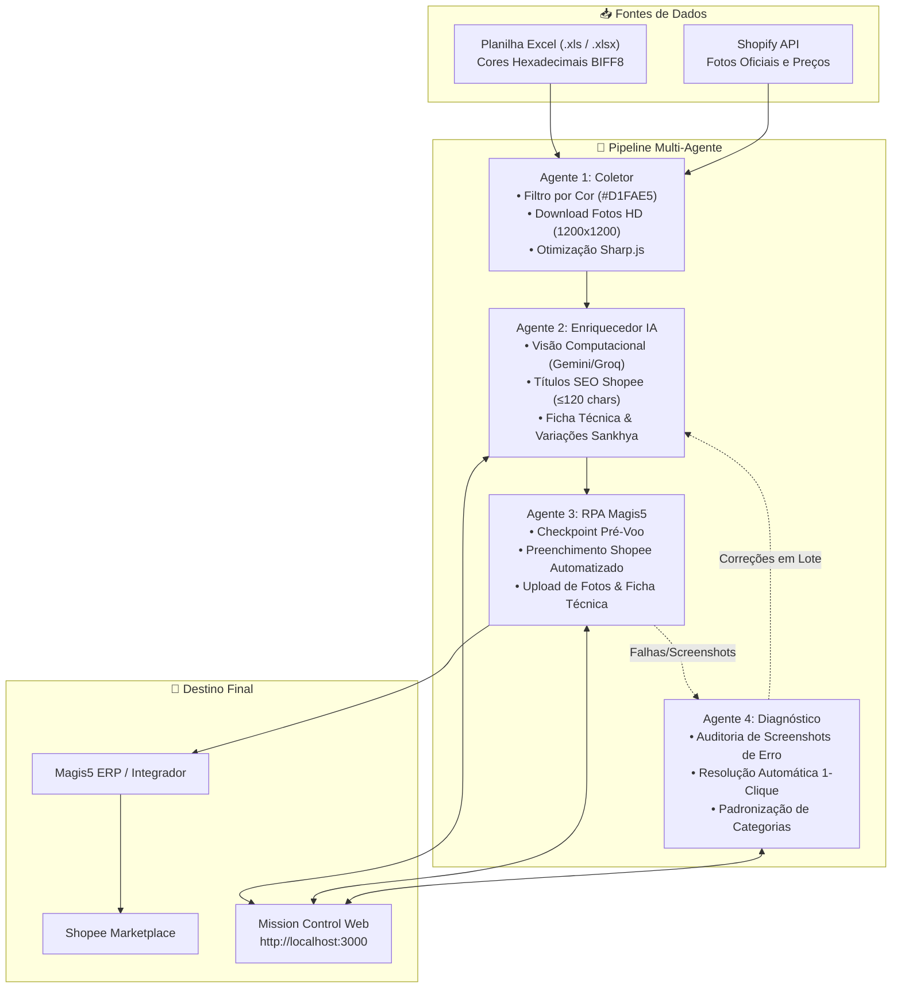

# Pipeline de Automação Shopee — BRK Fishing 🎣

Sistema integrado de agentes autônomos para extração, enriquecimento com Inteligência Artificial Multimodal, publicação automatizada via RPA na plataforma **Magis5** e diagnóstico de rejeições para a **Shopee**.

---

## 📑 Sumário

- [Visão Geral e Arquitetura](#-visão-geral-e-arquitetura)
- [Os 4 Agentes Autônomos](#-os-4-agentes-autônomos)
  - [Agente 1 — Coletor & Scraper](#1-agente-1--coletor--scraper-agent1-scraper)
  - [Agente 2 — Enriquecedor com IA Multimodal](#2-agente-2--enriquecedor-com-ia-multimodal-agent2-enricher)
  - [Agente 3 — Publicador RPA Magis5 / Shopee](#3-agente-3--publicador-rpa-magis5--shopee-agent3-rpa-magis5)
  - [Agente 4 — Diagnóstico e Soluções Automáticas](#4-agente-4--diagnóstico-e-soluções-automáticas-agent4-diagnostician)
- [Gestão Visual por Cores (Planilhas Excel)](#-gestão-visual-por-cores-planilhas-excel)
- [Central de Controle Web (Mission Control)](#-central-de-controle-web-mission-control)
- [Rotas da API HTTP do Servidor](#-rotas-da-api-http-do-servidor)
- [Regras de Categorias e Ficha Técnica](#-regras-de-categorias-e-ficha-técnica)
- [Instalação e Configuração](#-instalação-e-configuração)
- [Como Executar](#-como-executar)
- [Estrutura do Repositório](#-estrutura-do-repositório)
- [Resolução de Problemas (Troubleshooting)](#-resolução-de-problemas-troubleshooting)

---

## 🏛️ Visão Geral e Arquitetura

O pipeline foi projetado para operar de forma modular, permitindo a execução autônoma de cada etapa ou o controle unificado através do painel web.



---

## 🤖 Os 4 Agentes Autônomos

### 1. Agente 1 — Coletor & Scraper (`agent1-scraper`)
- **Leitura de Planilhas Binárias:** Suporta arquivos `.xls` legados (BIFF8) e `.xlsx` modernos, inspecionando tabelas de estilo `XFEXT` para extração da cor de preenchimento real de cada célula.
- **Coleta de Imagens Oficiais:** Conecta à API pública da Shopify da loja `brkfishing.com.br` e faz download das imagens dos produtos em resolução máxima (1200×1200) organizadas por SKU pai e variações.
- **Processamento de Imagens:** Converte automaticamente formatos WebP/PNG para JPEG de alta compatibilidade através do `sharp`.
- **Exportação de Lotes:** Gera arquivos CSV limpos (como `lote_d1fae5.csv`) contendo SKU, Código Sankhya, Título original e Cor de controle.

### 2. Agente 2 — Enriquecedor com IA Multimodal (`agent2-enricher`)
- **Visão Computacional Multimodal:** Utiliza os modelos **Google Gemini 2.5 Flash / Pro** e **Groq (LLaMA/Qwen)** para analisar fotos reais do produto em conjunto com os dados técnicos.
- **Geração de Conteúdo Otimizado para Shopee:**
  - **Título SEO:** Formulado com palavras-chave prioritárias de busca, respeitando a faixa ideal de 60 a 120 caracteres.
  - **Descrição Persuasiva:** Estrutura escaneável (benefícios, indicação de uso na pesca, especificações completas, dicas de conservação).
  - **Ficha Técnica:** Extração automática de atributos obrigatórios exigidos pelo marketplace.
- **Agrupamento Pai-Filho:** Agrupa variações de tamanho, cor ou modelo mantendo o código ERP Sankhya individual em cada filho.
- **Auditoria de SEO Score:** Avalia cada produto gerando pontuação de 0 a 100 com base em checklists rígidos de qualidade.
- **Servidor Web e API:** Hospeda a central de controle local na porta 3000 (`server.mjs`).

### 3. Agente 3 — Publicador RPA Magis5 / Shopee (`agent3-rpa-magis5`)
- **Navegador Automatizado:** Baseado em **Playwright**, operando em modo headless ou com interface visível (`--headed`).
- **Sessão Persistente:** Reutiliza cookies e tokens em `session.json`, dispensando logins repetitivos e prevenindo bloqueios por rate limit.
- **Validação de Pré-Voo (Checkpoint):**
  - Confere se todos os campos obrigatórios estão íntegros antes de abrir o navegador.
  - Possui mecanismo de fallback para preços: caso o cabeçalho não contenha o valor, resgata automaticamente os preços das variações.
  - Garante que nenhum produto sem preço válido seja enviado ao marketplace.
- **Preenchimento de Ponta a Ponta na Magis5:**
  - Seleção da integração Shopee.
  - Preenchimento de Título, Marca, Modelo, Medidas padrão de envio (3×20×30 cm, 0,250 kg) e Descrição.
  - Navegação e seleção da árvore de categorias em cascata de 4 níveis.
  - Geração da Ficha Técnica e preenchimento de mais de 18 atributos com conversão inteligente de unidades (ex: cm, g, meses de garantia).
  - Configuração da grade de variações com o Código ERP Sankhya no campo de SKU da variação.
  - Upload de fotos principais do anúncio e fotos específicas de cada variação (com limpeza de miniaturas residuais duplicadas).
  - Atualização automática de status para `publicado` e cor verde (`#83E28E`) na planilha após o sucesso.

### 4. Agente 4 — Diagnóstico e Soluções Automáticas (`agent4-diagnostician`)
- **Auditoria Contínua:** Monitora a pasta `screenshots/` e os registros de execução do robô.
- **Detecção de Causa-Raiz:** Classifica os erros retornados pela Magis5/Shopee:
  - Categoria recusada ou ausente.
  - Marca não cadastrada ou em desacordo com as diretrizes do marketplace.
  - Atributos obrigatórios pendentes na ficha técnica.
  - Violações de limite de imagens nas variações.
  - Conflito de SKU já cadastrado na plataforma.
- **Mecanismo de Resolução com 1 Clique:**
  - Aplica automaticamente a categoria oficial correta no arquivo JSON do produto.
  - Ajusta marcas para termos aceitos (ex: `Boaonda`, `Albatroz`, `Rapala`, `Deyu`).
  - Permite aplicar a solução individualmente ou em lote para toda a categoria (ex: todas as Varas de Pesca ou todas as Sandálias Masculinas).

---

## 🎨 Gestão Visual por Cores (Planilhas Excel)

O sistema utiliza os padrões visuais adotados pela equipe comercial nas planilhas de estoque para guiar a esteira de publicação:

| Cor Hexadecimal | Nome / Significado Comercial | Tratamento pelo Agente 3 (RPA) |
|---|---|---|
| `🟩 #D1FAE5` | **Cadastrado c/ Estoque (Pendente)** | **Apto à publicar:** Selecionado para processamento na Magis5 |
| `🟢 #83E28E` | **Publicado / Concluído** | **Ignorado automaticamente:** Evita duplicação de anúncios e retrabalho |
| `✅ #47D359` | **Concluído e Validado** | **Ignorado automaticamente:** Produto finalizado |

---

## 💻 Central de Controle Web (Mission Control)

Ao iniciar o servidor (`node server.mjs`), a aplicação disponibiliza três telas interativas em `http://localhost:3000`:

### 1. Painel Geral (`/painel.html`)
- **Métricas do Catálogo:** Total de linhas na planilha, produtos enriquecidos com IA, pendentes de publicação e publicados.
- **Disparo com 1 Clique:** Botões para iniciar ou parar o Agente 1 (Scraper), Agente 2 (IA), Agente 3 (Publicador) e Agente 4 (Diagnóstico).
- **Prévia do Lote:** Tabela ordenada exatamente na sequência da planilha, exibindo SKU, título, código Sankhya, variações, preço e status.
- **Modal de Lote:** Seleção de limites de processamento (ex: 5, 10, 25 produtos por rodada) com indicação visual dos SKUs que entrarão no lote.
- **Terminal de Logs em Tempo Real:** Visualizador com autoscroll e badges de streaming stdout/stderr.
- **Upload de Novas Planilhas:** Arraste e solte planilhas `.xls`, `.xlsx` ou `.csv` para alimentar o pipeline diretamente pelo navegador.

### 2. Painel de Rejeições & Diagnósticos (`/rejeitados.html`)
- **Visão de Rejeições:** Exibição dos produtos que falharam durante a execução do robô.
- **Evidências Visuais:** Miniaturas das capturas de tela tiradas no exato instante da falha (`screenshots/erro-*.png`).
- **Solução Proposta:** Diagnóstico claro do motivo da rejeição acompanhado da ação recomendada.
- **Ações Rápidas:**
  - `Aplicar Solução Automática`: Atualiza o JSON do produto com a categoria, marca ou atributos corrigidos.
  - `Aplicar a Todos Desta Categoria`: Replica a correção para todos os produtos correlatos da base.
  - `Abrir Ficha Técnica`: Visualização de todos os atributos gerados.

### 3. Relatório Completo de Enriquecimento (`/relatorio.html`)
- **Galeria Visual:** Visualização de todos os 134 produtos enriquecidos com fotos originais e variações.
- **Checklist de SEO:** Indicadores de tamanho de título, persuasão da cópia, escaneabilidade e densidade de palavras-chave.
- **Auditoria de Arquivos Locais:** Status da existência das imagens em disco e integridade do JSON gerado.

---

## 🔌 Rotas da API HTTP do Servidor

O servidor `server.mjs` expõe as seguintes rotas REST:

| Método | Endpoint | Descrição |
|---|---|---|
| `GET` | `/api/stats` | Retorna métricas globais do catálogo, contagem de status e estado atual dos agentes |
| `GET` | `/api/agents/logs` | Retorna os últimos 500 logs em tempo real |
| `GET` | `/api/files` | Lista as planilhas disponíveis para processamento |
| `GET` | `/api/batch/preview` | Retorna a fila ordenada de produtos pendentes e concluídos do lote |
| `POST` | `/api/upload` | Recebe upload de novas planilhas codificadas em base64 |
| `POST` | `/api/agents/start` | Inicia a execução de um agente (`agent1`, `agent2`, `agent3`, `agent4`) com parâmetros opcionais |
| `POST` | `/api/agents/stop` | Interrompe imediatamente o processo em execução |
| `POST` | `/api/status` | Atualiza manualmente o status de um SKU (`publicado` ou `pendente`) no CSV e no JSON |
| `GET` | `/api/diagnostics` | Executa o Agente 4 e retorna os diagnósticos de rejeições e soluções |
| `POST` | `/api/diagnostics/apply` | Aplica a solução automática em um produto específico |
| `POST` | `/api/diagnostics/apply-all` | Aplica a correção de categoria/marca para todos os produtos do grupo |

---

## 📐 Regras de Categorias e Ficha Técnica

Para garantir conformidade com as regras da Shopee e evitar rejeições na Magis5, o sistema implementa categorizações e fichas técnicas padronizadas:

### Varas de Pesca
- **Caminho da Categoria Shopee:**  
  `Esportes e Atividades ao Ar Livre > Equipamentos Esportivos e Recreação ao Ar Livre > Pescaria > Varas e Molinetes de Pesca`
- **Atributos Obrigatórios na Ficha Técnica:**
  - **Material:** `Fibra de Carbono`
  - **Comprimento:** Valor numérico no campo de texto + Escala `cm` selecionada no seletor
  - **Peso do Produto:** Valor em gramas aproximado para a opção mais próxima (ex: `150g`, `200g`)
  - **Duração da Garantia:** `1 Mês`
  - **País de Origem:** `China`
  - **Condição:** `Novo`
  - **Produto Personalizado:** `Não`
  - **Quantidade por Pacote:** `1`
  - **Tamanho do Pacote:** Deixado em branco (evita rejeição)

### Sandálias e Calçados Masculinos (Boaonda / Linha Brave, Colt, Star)
- **Caminho da Categoria Shopee:**  
  `Sapatos Masculinos > Sandalia e Chinelos > Chinelos`
- **Atributos Padronizados:**
  - **Material:** `Sintético` / `EVA`
  - **Estilo do Sapato:** `Sandália` / `Chinelo`
  - **País de Origem:** `Brasil`
  - **Duração da Garantia:** `1 Mês`
  - **Condição:** `Novo`
  - **Ajuste Amplo:** `Não`

### Iscas Artificiais e Linhas de Pesca
- **Iscas:** `... > Pescaria > Iscas`
- **Linhas:** `... > Pescaria > Linhas de Pesca`
- **Anzóis:** `... > Pescaria > Anzóis de Pesca`
- **Acessórios Gerais:** `... > Pescaria > Acessórios de Pesca`

---

## ⚙️ Instalação e Configuração

### 1. Pré-requisitos
- **Node.js** v18.0.0 ou superior
- **npm** v9.0.0 ou superior
- Navegador Google Chrome / Chromium instalado (o Playwright fará o download do driver automaticamente)

### 2. Clonar o Repositório
```bash
git clone https://github.com/thalgy2000-collab/AutomationShopee.git
cd AutomationShopee
```

### 3. Instalação das Dependências
Execute a instalação nos módulos do sistema:
```powershell
# Agente 1
cd agent1-scraper ; npm install ; cd ..

# Agente 2
cd agent2-enricher ; npm install ; cd ..

# Agente 3
cd agent3-rpa-magis5 ; npm install ; npx playwright install chromium ; cd ..
```

### 4. Configuração das Variáveis de Ambiente

Crie o arquivo `.env` dentro de `agent2-enricher/`:
```env
GEMINI_API_KEY=sua_chave_do_google_gemini
GEMINI_MODEL=gemini-2.5-flash
GROQ_API_KEY=sua_chave_opcional_groq
```

Crie o arquivo `.env` dentro de `agent3-rpa-magis5/`:
```env
MAGIS5_LOGIN_URL=https://app.magis5.com.br/v2/admin/autenticacao/login.php
MAGIS5_BASE_URL=https://app.magis5.com.br
MAGIS5_EMAIL=seu_usuario@empresa.com.br
MAGIS5_PASSWORD=sua_senha_secreta
MAGIS5_INTEGRATION_NAME=Shopee
HEADLESS=true
ACTION_TIMEOUT_MS=15000
NAVIGATION_TIMEOUT_MS=30000
```

---

## 🚀 Como Executar

### Modo 1: Via Central de Controle Web (Recomendado)
Inicie o servidor HTTP central:
```powershell
cd agent2-enricher
node server.mjs
```
Acesse **[http://localhost:3000](http://localhost:3000)** e controle todos os agentes pela interface visual.

### Modo 2: Via Linha de Comando (CLI)

#### Executar Agente 1 (Scraper):
```powershell
cd agent1-scraper
# Extrai produtos com cor #D1FAE5 da planilha original:
node scraper.mjs --input "C:\caminho\planilha.xls" --color "#D1FAE5" --limit 10
```

#### Executar Agente 2 (Enriquecedor IA):
```powershell
cd agent2-enricher
# Processa produtos enriquecendo com Gemini:
node enricher.mjs --limit 10
# Regenera o relatório HTML:
node report.mjs
```

#### Executar Agente 3 (Publicador RPA Magis5):
```powershell
cd agent3-rpa-magis5
# Modo de Simulação Segura (Dry-Run):
node src/runner.mjs --limit 5

# Publicação Real em Produção:
node src/runner.mjs --publish --limit 10

# Com navegador visível na tela:
node src/runner.mjs --publish --headed --limit 5

# Processar apenas um SKU específico:
node src/runner.mjs --sku "7793423361089" --publish --headed
```

#### Executar Agente 4 (Diagnóstico):
```powershell
cd agent4-diagnostician
node diagnose.mjs
```

---

## 📁 Estrutura do Repositório

```text
AutomationShopee/
├── README.md                           ← Documentação completa do sistema
├── .gitignore                          ← Proteção de dados confidenciais (.env, session, downloads)
├── sync_shopee_catalog.mjs             ← Script utilitário de sincronização com a Shopee
│
├── agent1-scraper/                     ← AGENTE 1: Coletor & Scraper
│   ├── scraper.mjs                     ← Motor de download e extração
│   ├── create_lote.mjs                 ← Utilitário de filtragem por cor hexadecimal
│   ├── lote_d1fae5.csv                 ← Planilha de trabalho do lote atual
│   └── downloads/                      ← Imagens dos produtos organizadas por SKU
│
├── agent2-enricher/                    ← AGENTE 2: Enriquecedor IA & Servidor Web
│   ├── server.mjs                      ← Servidor HTTP / API REST da Central de Controle
│   ├── enricher.mjs                    ← Script de enriquecimento com Gemini / Groq
│   ├── report.mjs                      ← Gerador do relatório visual de auditoria
│   ├── painel.html                     ← Central de Controle (Mission Control)
│   ├── rejeitados.html                 ← Central de Rejeições & Soluções Automáticas
│   ├── relatorio.html                  ← Relatório visual completo de catálogo
│   └── produtos/                       ← 134 arquivos JSON enriquecidos por SKU
│
├── agent3-rpa-magis5/                  ← AGENTE 3: Publicador RPA Magis5 / Shopee
│   ├── session.json                    ← Sessão autenticada persistente (Playwright)
│   ├── screenshots/                    ← Capturas de tela de sucesso e erros
│   └── src/
│       ├── runner.mjs                  ← CLI principal e orquestrador do RPA
│       ├── publisher.mjs               ← Automação do formulário, variações e fotos
│       ├── checkpoint.mjs              ← Validação de pré-voo e fallback de preços
│       ├── auth.mjs                    ← Gerenciamento de login e cookies
│       └── config.mjs                  ← Configurações e constantes do robô
│
└── agent4-diagnostician/               ← AGENTE 4: Diagnóstico de Rejeições
    ├── diagnose.mjs                    ← Motor de auditoria de screenshots e falhas
    ├── rules.mjs                       ← Catálogo de regras oficiais Shopee e resoluções
    └── diagnostics_result.json         ← Relatório consolidado de diagnósticos
```

---

## 🛠️ Resolução de Problemas (Troubleshooting)

### 1. "Total de produtos aptos à publicar: 0"
- **Causa:** O Checkpoint de Pré-Voo (`checkpoint.mjs`) bloqueou o produto porque o campo de preço (`preco`) estava nulo ou vazio, ou o produto já constava com status `publicado` ou cor verde `#83E28E`.
- **Solução:** O `checkpoint.mjs` já possui fallback inteligente para variações. Certifique-se de que o produto possui preço no JSON em `agent2-enricher/produtos/{sku}.json` e que seu status no CSV esteja como `enriched` / cor `#D1FAE5`.

### 2. "SKU já cadastrado em outro produto" no Magis5
- **Causa:** O produto já foi cadastrado anteriormente na loja Shopee ou Magis5.
- **Solução:** No painel de diagnósticos (`rejeitados.html`), marque o produto como já existente ou utilize o script `sync_shopee_catalog.mjs` para reconciliar o catálogo e atualizar o status para `publicado` (`#83E28E`).

### 3. "Shopee: X/1 imagens de variação"
- **Causa:** O Magis5 herdou todas as fotos da galeria principal para dentro da caixinha da variação, ultrapassando o limite da Shopee (máximo 1 foto por variação).
- **Solução:** O módulo `publisher.mjs` já inclui a rotina `limparFotosResiduaisDaVariacao()`, que remove as imagens herdadas automaticamente antes de anexar a foto exclusiva da variação.

### 4. "Erro de autenticação ou sessão expirada"
- **Causa:** O token salvo em `session.json` expirou na Magis5.
- **Solução:** O Agente 3 detecta o redirecionamento para a tela de login e refaz a autenticação automaticamente utilizando as credenciais cadastradas no arquivo `.env`.

---

## 📄 Licença e Propriedade

Desenvolvido exclusivamente para o catálogo e operação de e-commerce da **BRK Fishing**. Todos os direitos reservados.
